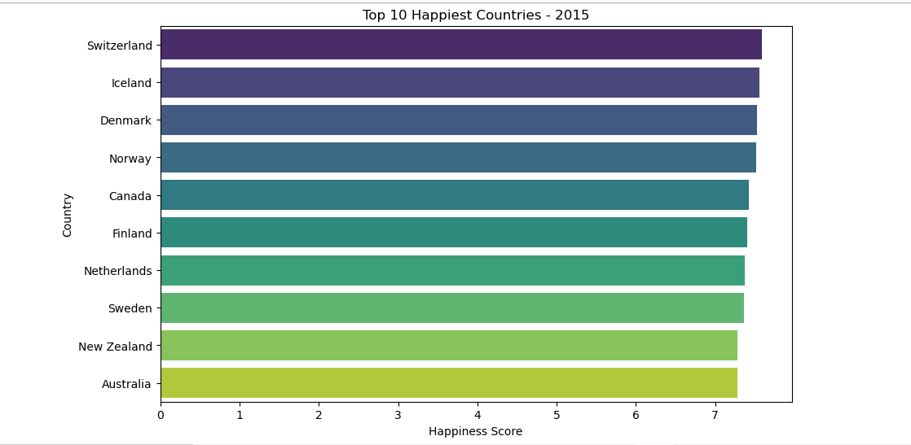
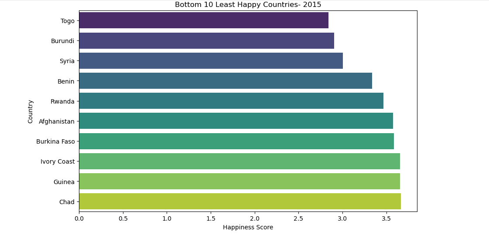
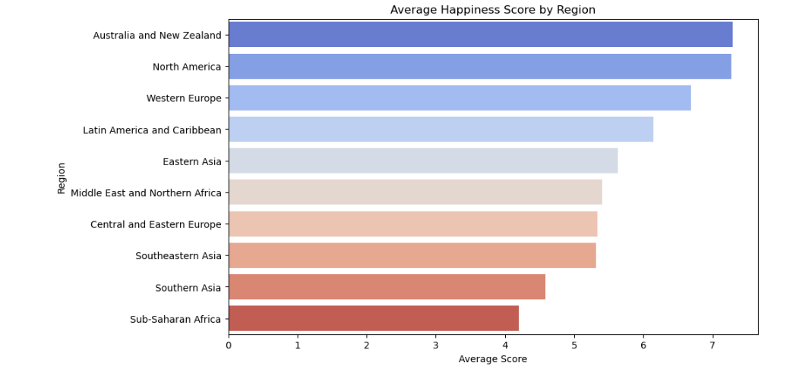
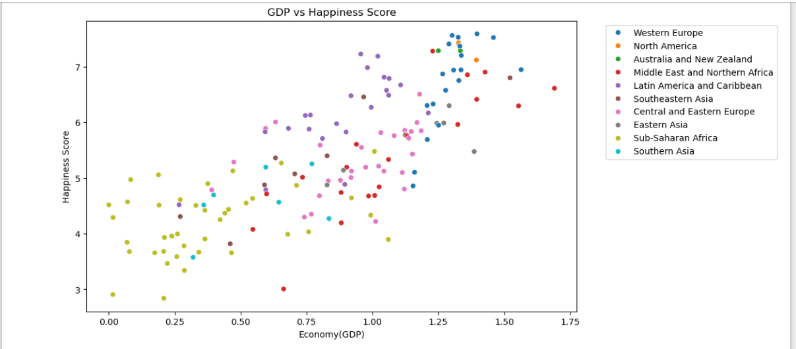

# 🌍 World Happiness Analysis - 2015

This project explores global happiness data using the 2015 World Happiness Report. We analyze and visualize patterns in happiness scores, GDP, region-wise differences, and correlations between variables.

## 📌 Objectives:
- Visualize top 10 happiest and least happy countries
- Analyze the relation between GDP and happiness
- Compare happiness scores region-wise
- Show correlation between different features

## 📊 Dataset Overview:
- Source: [World Happiness Report on Kaggle](https://www.kaggle.com/datasets/unsdsn/world-happiness)
- Used: Report from the year 2015
- No missing values, clean and ready to use

## 🖼️ Visual Outputs

Here are some of the visualizations generated:

| 📍 Plot | Preview |
|--------|---------|
| Top 10 Happiest Countries |  |
| Least Happy Countries |  |
| Region-wise Comparison |  |
| Region-Wise Mean Happiness |  |

## 📈 Tools Used:
- **Python**: Data analysis & visualization
- **Pandas**: Data manipulation
- **Seaborn & Matplotlib**: Visualization
- **Jupyter Notebook**

## ✅ Skills Practiced:
- Data Cleaning
- Sorting & Grouping
- Correlation & Heatmaps
- Advanced Seaborn Charts

---
